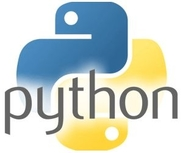
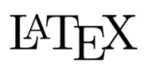

# What is it?

Program for scientific research, which allows to simulate the phenomenon of self-focusing of different laser beams (including Gaussian, annular and vortex beams) in solid media in different approximations taking into account noise.

[wiki](https://github.com/VasilyevEvgeny/self-focusing/wiki)

<p align="center">

</p>

# Requirements

* Python 3



* pdflatex



# Installation

* **Windows**:
```pwsh
virtualenv venv
cd venv/Scripts
activate
pip install -r <path_to_project>/requirements.txt
```

* **Linux**
```bash
virtualenv venv -p python3
cd venv
source activate
pip install -r <path_to_project>/requirements.txt
```

# [Mathematical model](math_model/math_model.pdf)

A mathematical model of beams self-focusing was obtained using the method of slowly varying amplitudes and the terms responsible for diffraction and instantaneous Kerr effect are included. The model can be used to consider three-dimensional beams both in the axisymmetric approximation, and with both transverse spatial coordinates including ring beams with a phase singularity on the optical axis - the so-called optical vortices. The possibility of considering ring beams without phase singularity, as well as Gaussian beams, is supported. Implemented accounting for complex noise in the initial condition. In addition, two-dimensional beams are also considered.
